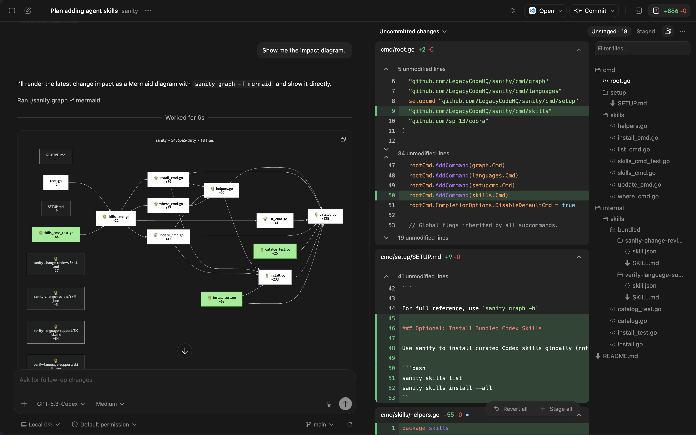

# Sanity

[](https://raw.githubusercontent.com/LegacyCodeHQ/sanity/main/badges/built-with-sanity-sunrise.svg)
[](LICENSE)
[](https://github.com/LegacyCodeHQ/sanity/releases)
[](https://www.npmjs.com/package/@legacycodehq/sanity)
[](https://goreportcard.com/report/github.com/LegacyCodeHQ/sanity)

Sanity is a software design tool for developers and coding agents.

## Use Cases

- Build maintainable software
- Understand codebases
- [Audit AI-generated code](https://youtu.be/EqOwJnZSiQs)
- Stabilize and reclaim apps built with AI

## Quick Start

**Step 1:** Install with npm (cross-platform):

```bash
npm install -g @legacycodehq/sanity
```

Or install on macOS/Linux using Homebrew:

```bash
brew install sanity
```

**Step 2:** Inside your project:

```bash
sanity setup  # Add usage instructions to AGENTS.md for your coding agent
```

For other installation methods (pre-built binaries, build from source, Go install), see the [Installation Guide](docs/usage/installation.md).

## The Problem

Every time a coding agent makes changes to your codebase, you have the following questions:

- Which files should I review first and in what order?
- Where should I spend most of my review effort?
- What is the blast radius of this change?
- Which parts of the change are too risky?
- How does this solution fit into the existing system?
- Are there adequate tests for these changes?

These concerns worsen when there are:

- Too many files to review
- You have an outdated mental model of your codebase

## How Sanity Helps

Sanity uses a file-based dependency graph to visualize the impact of AI-generated changes, showing you:

- The files changed and the relationships between them
- The order to review files (simple answer: review from right-to-left)
- Color-coded files by extension to help you quickly categorize and group them for review
- Test files at a glance
- An accurate mental model of the system as you evolve it

## See Sanity in Action

Sanity works with Desktop and IDE coding agents. If you are using a CLI coding agent, the agent can open diagrams in your browser for review.

<p align="center">
  
  <small>Sanity shows impacted files and highlights tests in green.</small>
</p>

## Supported Languages

- C
- C++
- C#
- Dart
- Go
- JavaScript
- Java
- Kotlin
- Python
- Ruby
- Rust
- Swift
- TypeScript

## License

```
This project is licensed under the GNU Affero General Public License v3.0.
```
